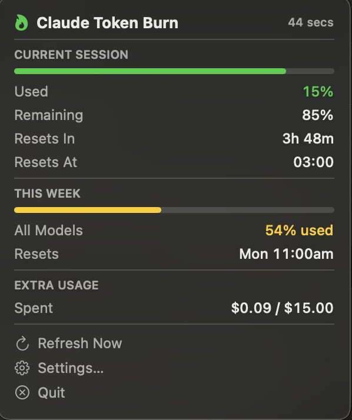

# Claude Token Burn 🔥

A lightweight native macOS menu bar app that shows your Claude token usage in real time — right next to the clock.



## What it shows


- **%** — how much of your current 5-hour session you've used (matches Claude Settings → Usage)
- **Timer** — how long until your session resets
- **Colour** — green → yellow → orange → red as you burn through tokens

Click the icon for a detailed breakdown: session %, weekly limits by model, and extra usage spend.

## Requirements

- macOS 13 (Ventura) or later
- [Claude Code](https://claude.ai/code) installed and logged in
- Xcode Command Line Tools (`xcode-select --install`)

## Install

```bash
git clone https://github.com/AsTheSeaRises/Claude-Token-Burn
cd claude-token-burn
./build.sh
open ClaudeTokenBurn.app
```

To install permanently:

```bash
cp -r ClaudeTokenBurn.app /Applications/
open /Applications/ClaudeTokenBurn.app
```

## How it works

The app reads your Claude OAuth token directly from the macOS Keychain — the same token Claude Code stores when you log in. It then calls Anthropic's usage API to get your real-time session data. No separate login, no API key needed.

**Token refresh:** Claude Code automatically keeps the token fresh as long as you use it. If the token expires, the app detects it instantly (no wasted retries) and shows a **Login to Claude** button in the dropdown. Click it — a browser window opens for OAuth approval, and the app refreshes automatically once you're signed in.

## Settings

Right-click the menu bar icon → **Settings** to configure:

- Refresh interval (default: 60s)
- Notification alerts at configurable usage thresholds (default: 75%, 90%, 95%)
- Launch at login
- Show/hide extra usage spend

Settings are saved to `~/Library/Application Support/ClaudeTokenBurn/settings.json`.

## Rebuild after changes

```bash
./build.sh
pkill -x ClaudeTokenBurn
open ClaudeTokenBurn.app
```

## Limitations

- Requires Claude Code to be installed — it piggybacks on Claude Code's authentication
- Token data updates every 60 seconds by default

## License

MIT
